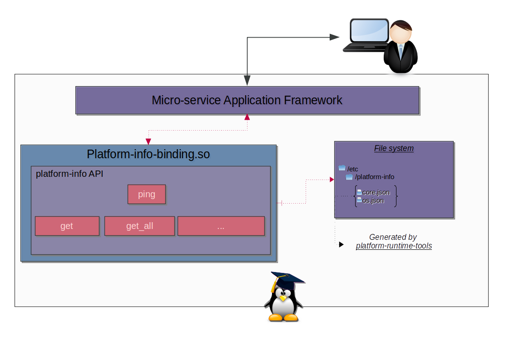

# Architecture & Presentation

## I - Architecture

## II - Presentation

Previously used for AGL project, this binding reads system and platform information and expose them through its API. The binding reads all files within **/etc/platform-info** directory and try
to serialize them as JSON. Then you could access to a JSON object using a doted path.

All necessary files in the folder **/etc/platform-info** will be created by the tool: **platform-runtime-tools**
